# 5. Diseño de la interfaz (UX/UI)

Esta sección describe cómo se ve y cómo se recorre MisLukas. Primero presentamos el flujo de navegación completo; luego cada pantalla con su objetivo, sus elementos y las acciones disponibles; después los estados que puede tener la interfaz, la guía de estilo, los principios de diseño móvil aplicados y el estado actual de los bocetos.

Los bocetos se construyeron en Figma a partir de un sistema visual común, de modo que todas las pantallas compartan colores, tipografía, componentes y comportamiento. La idea detrás del diseño es que la aplicación se sienta tranquila y ordenada: el dinero ya genera suficiente ansiedad como para que la interfaz sume ruido.

## 5.1 Flujo de navegación

La navegación de MisLukas se organiza en tres bloques: el acceso, que decide si el usuario debe iniciar sesión o solo desbloquear la app; la navegación principal, con una barra inferior de cuatro pestañas; y el flujo de registro de un gasto, que se abre desde la pantalla de inicio y regresa a ella al terminar.

**Decisión al abrir la aplicación.** Cada vez que el usuario abre MisLukas, la aplicación revisa si existe una sesión guardada en el almacenamiento seguro del dispositivo:

- **Si no hay sesión**, muestra la pantalla de inicio de sesión y registro.
- **Si hay sesión**, muestra la pantalla de desbloqueo con huella, rostro o PIN. Solo después de desbloquear se muestra información financiera.

Esta decisión evita dos problemas opuestos: pedir la contraseña cada vez, lo que haría la app incómoda, y abrirla directamente, lo que expondría los datos a cualquiera que tome el celular.

**Navegación principal.** Una vez dentro, la barra inferior da acceso directo a las cuatro secciones de la aplicación: Inicio, Reportes, Simular y Perfil. Se eligió una barra inferior y no un menú lateral porque las cuatro secciones son de uso frecuente y deben estar siempre a un toque y al alcance del pulgar.

**Flujo de nuevo gasto.** Desde Inicio, el botón "Nuevo gasto" abre la selección del método de registro. Ambos métodos terminan en la pantalla de confirmación, y al guardar el usuario regresa a Inicio con un mensaje de confirmación.

**Diagrama de flujo.** El siguiente código genera el diagrama en Mermaid. Se puede renderizar en mermaid.live o en FigJam y exportar como imagen para el documento.

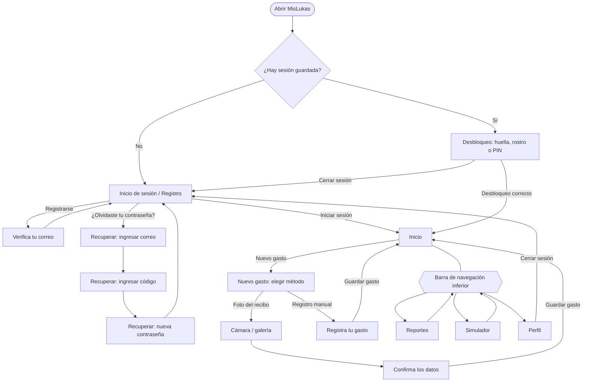

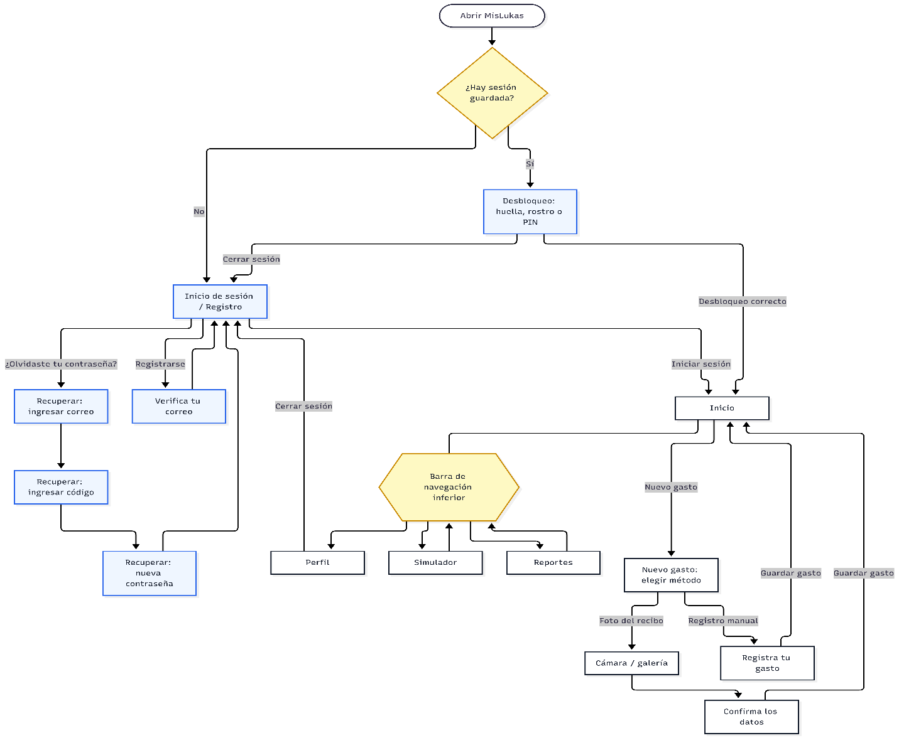

Flujo de navegación de MisLukas.

## 5.2 Descripción de pantallas

Para cada pantalla se describe su objetivo, los elementos que la componen y las acciones que puede realizar el usuario. Las pantallas del bloque A que aún no tienen boceto se documentan como especificación de diseño, para que su construcción en Figma siga los mismos criterios.

**A. Autenticación**

**Pantalla 1. Inicio de sesión**

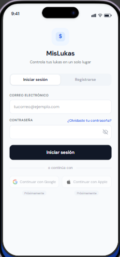

_Figura 5.2. Captura de la pantalla de inicio de sesión_

**Objetivo.** Permitir que un usuario registrado acceda a su cuenta de forma rápida y segura.

**Elementos.**

- Identidad de la aplicación en la parte superior: ícono de moneda en un recuadro azul claro, el nombre "MisLukas" y el lema "Controla tus lukas en un solo lugar".
- Selector de dos pestañas, "Iniciar sesión" y "Registrarse", que permite cambiar entre ambos formularios sin salir de la pantalla. La pestaña activa se resalta con fondo blanco.
- Campo **CORREO ELECTRÓNICO** con el texto de ejemplo "[tucorreo@ejemplo.com](mailto:tucorreo@ejemplo.com)".
- Campo **CONTRASEÑA** con un ícono de ojo para mostrar u ocultar lo escrito.
- Enlace "¿Olvidaste tu contraseña?" en azul, ubicado a la altura de la etiqueta del campo de contraseña, justo donde el usuario lo busca cuando no la recuerda.
- Botón principal "Iniciar sesión" en color oscuro y de ancho completo.
- Separador "o continúa con" y dos botones, "Continuar con Google" y "Continuar con Apple", deshabilitados y marcados con la etiqueta "Próximamente".

**Acciones.**

- Iniciar sesión con correo y contraseña.
- Mostrar u ocultar la contraseña.
- Ir al formulario de registro o al flujo de recuperación de contraseña.

**Decisiones de diseño.** Unir el inicio de sesión y el registro en una sola pantalla con pestañas reduce la navegación y deja claro que son dos caminos para el mismo destino. Los botones de Google y Apple se incluyen desde ahora, aunque deshabilitados, para reservar su espacio y que la incorporación futura no obligue a rediseñar la pantalla. Ante credenciales incorrectas, la pantalla muestra un mensaje genérico, sin indicar si el error está en el correo o en la contraseña; tras varios intentos fallidos, muestra un aviso de bloqueo temporal (sección 8.2).

**Pantalla 2. Registro**

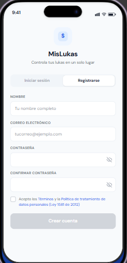

_Figura 5.3. Captura de la pantalla de registro_

**Objetivo.** Permitir que un usuario nuevo cree su cuenta entregando solo los datos necesarios y aceptando de forma explícita el tratamiento de sus datos.

**Elementos.**

- Mismo encabezado y selector de pestañas de la pantalla anterior, con "Registrarse" activo.
- Campos **NOMBRE**, **CORREO ELECTRÓNICO**, **CONTRASEÑA** y **CONFIRMAR CONTRASEÑA**, estos dos últimos con opción de mostrar u ocultar.
- Indicador de fortaleza de la contraseña (débil, media o fuerte) y lista de requisitos que se marcan en verde al cumplirse. Aparece cuando el usuario empieza a escribir.
- Casilla de aceptación: "Acepto los Términos y la Política de tratamiento de datos personales (Ley 1581 de 2012)", con los documentos enlazados.
- Botón "Crear cuenta", que permanece en gris y deshabilitado hasta que todos los campos son válidos y la casilla está marcada.

**Acciones.**

- Completar el formulario y crear la cuenta.
- Consultar los términos y la política de datos.
- Volver a la pestaña de inicio de sesión.

**Decisiones de diseño.** El botón deshabilitado evita que el usuario envíe un formulario incompleto y descubra los errores después; el sistema le indica desde el principio qué falta. El formulario pide solo cuatro campos: el nombre se usa para personalizar el saludo y el correo para la autenticación y la recuperación. No se solicitan datos como teléfono, documento o fecha de nacimiento porque la aplicación no los necesita, lo que responde al principio de minimización de datos (sección 8.9).

**Pantalla 3. Recuperar contraseña _(por diseñar)_**

**Objetivo.** Permitir que el usuario recupere el acceso a su cuenta sin exponer información sobre qué correos están registrados.

**Especificación.** Un flujo de tres pasos con un indicador de progreso ("Paso 1 de 3") en la parte superior:

1. **Correo:** campo de correo y botón "Enviar código". Al enviar, se muestra siempre el mismo mensaje: "Si el correo está registrado, te enviaremos un código de verificación".
2. **Código:** seis casillas para los dígitos del código, texto con el tiempo de validez, enlace "Reenviar código" con un contador de espera y botón "Verificar".
3. **Nueva contraseña:** campos de nueva contraseña y confirmación, con el mismo indicador de fortaleza del registro, y botón "Guardar contraseña".

Al terminar, una pantalla de confirmación informa que la contraseña se actualizó y que por seguridad se cerró la sesión en los demás dispositivos, con un botón para volver a iniciar sesión.

**Decisiones de diseño.** Dividir el proceso en pasos cortos reduce la carga para el usuario y permite validar cada dato antes de avanzar. El mensaje idéntico en el primer paso evita que alguien use esta pantalla para averiguar si un correo tiene cuenta en MisLukas.

**Pantalla 4. Desbloqueo _(por diseñar)_**

**Objetivo.** Proteger la información cuando el usuario ya tiene sesión iniciada, sin obligarlo a escribir la contraseña cada vez.

**Especificación.**

- Saludo personalizado ("Hola, Camila") y el texto "Desbloquea para ver tus finanzas".
- Ícono de huella o de rostro en un círculo azul claro, que al tocarse activa la autenticación biométrica del sistema.
- Botón secundario "Usar PIN", que muestra cuatro indicadores y un teclado numérico grande.
- Enlace "¿No eres Camila? Cerrar sesión" en la parte inferior.

**Decisiones de diseño.** La pantalla no muestra ningún dato financiero hasta que el desbloqueo es exitoso. El PIN existe como alternativa porque no todos los dispositivos tienen sensor biométrico y porque la biometría puede fallar, por ejemplo, con las manos mojadas o con poca luz.

**B. Principales**

**Pantalla 5. Inicio**

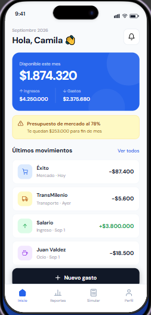

_Figura 5.4. Captura de la pantalla de inicio_

**Objetivo.** Responder de un vistazo a la pregunta "¿cuánto me queda este mes?" y dar acceso inmediato al registro de un gasto.

**Elementos.**

- **Encabezado** con el mes actual, el saludo "Hola, Camila" y un botón de notificaciones.
- **Tarjeta principal** en azul con el texto "Disponible este mes" y el monto \$1.874.320 en tamaño grande. Debajo, los dos valores que lo componen: ingresos por \$4.250.000 con una flecha hacia arriba y gastos por \$2.375.680 con una flecha hacia abajo.
- **Alerta de presupuesto** en amarillo con un ícono de advertencia: "Presupuesto de mercado al 78%. Te quedan \$253.000 para fin de mes".
- **Sección "Últimos movimientos"** con el enlace "Ver todos". Cada movimiento se muestra en una tarjeta con el ícono de su categoría sobre un fondo de color, el nombre del comercio o concepto, la categoría y la fecha en gris, y el monto a la derecha: negro con signo menos para los gastos y verde con signo más para los ingresos.
- **Botón "+ Nuevo gasto"** de ancho completo, ubicado sobre la barra de navegación.
- **Barra de navegación inferior** con Inicio activo.

**Acciones.**

- Registrar un nuevo gasto.
- Ver el historial completo de movimientos.
- Tocar un movimiento para ver su detalle, editarlo o eliminarlo.
- Navegar a las demás secciones.

**Decisiones de diseño.** La pantalla sigue un orden de lectura de lo general a lo particular: primero el disponible, luego lo que requiere atención (la alerta) y por último el detalle (los movimientos). Mostrar los ingresos y los gastos junto al disponible le permite al usuario entender de dónde sale esa cifra sin tener que calcularla. El botón de nuevo gasto se ubica en la zona inferior, la más fácil de alcanzar con el pulgar, porque es la acción que más se repite en la aplicación.

**Pantalla 6. Nuevo gasto**

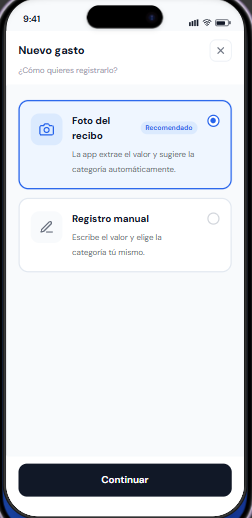

_Figura 5.5. Captura de la pantalla de nuevo gasto_

**Objetivo.** Permitir que el usuario elija cómo registrar el gasto, guiándolo hacia el método más rápido.

**Elementos.**

- Encabezado "Nuevo gasto" con la pregunta "¿Cómo quieres registrarlo?" y un botón para cerrar.
- Tarjeta **"Foto del recibo"** con ícono de cámara, etiqueta "Recomendado" y la descripción "La app extrae el valor y sugiere la categoría automáticamente". Aparece seleccionada por defecto, con borde azul y fondo azul muy claro.
- Tarjeta **"Registro manual"** con ícono de lápiz y la descripción "Escribe el valor y elige la categoría tú mismo".
- Indicador de selección tipo radio a la derecha de cada tarjeta.
- Botón "Continuar" en la parte inferior.

**Acciones.**

- Seleccionar un método y continuar.
- Cerrar la pantalla y volver a Inicio.

**Decisiones de diseño.** La foto del recibo viene seleccionada por defecto porque es el método que queremos promover: es el que reduce la fricción del registro, que es el problema central que la aplicación busca resolver. Aun así, el usuario tiene el control y puede cambiar de opción con un toque. Cada opción incluye una descripción breve para que quien use la aplicación por primera vez sepa qué esperar de cada método.

**Pantalla 7. Confirma los datos**

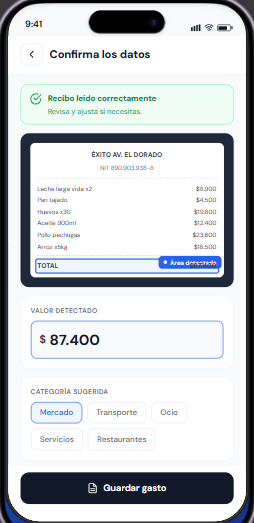

_Figura 5.6. Captura de la pantalla de confirmación con recibo_

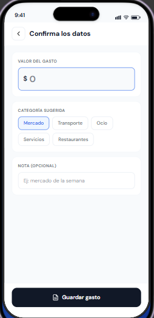
_Figura 5.7. Captura de la variante de registro manual_

**Objetivo.** Mostrar lo que la aplicación detectó en el recibo y permitir que el usuario lo revise, lo corrija si es necesario y guarde el gasto.

**Elementos (variante con recibo).**

- Encabezado con flecha para volver y el título "Confirma los datos".
- Banner verde con un ícono de verificación: "Recibo leído correctamente. Revisa y ajusta si necesitas".
- Vista previa del recibo sobre fondo oscuro, con el nombre del comercio, el NIT, los productos con sus precios y la línea del total resaltada en azul con la etiqueta "Área detectada".
- Campo **VALOR DETECTADO** con el monto (\$ 87.400) en tamaño grande y editable.
- **CATEGORÍA SUGERIDA** con chips seleccionables: Mercado, Transporte, Ocio, Servicios y Restaurantes. La categoría sugerida aparece marcada.
- Campo **NOTA (OPCIONAL)**.
- Botón "Guardar gasto" con un ícono de documento.

**Variante de registro manual.** Conserva la misma estructura, pero sin el banner ni la vista previa del recibo. El campo cambia a **VALOR DEL GASTO** y aparece vacío, listo para escribir.

**Acciones.**

- Editar el valor.
- Cambiar la categoría.
- Agregar una nota.
- Guardar el gasto o volver a la pantalla anterior.

**Decisiones de diseño.** Mostrar la imagen del recibo con el área detectada resaltada le permite al usuario verificar de dónde salió el valor y confiar en el resultado. Esa transparencia es importante: si la aplicación se equivoca y el usuario no puede ver por qué, deja de confiar en la función. El valor se muestra grande y editable porque es el dato más importante y el que con más probabilidad necesita corrección. Usar una sola pantalla para ambas variantes mantiene la consistencia y simplifica el desarrollo.

**Pantalla 8. Reportes**

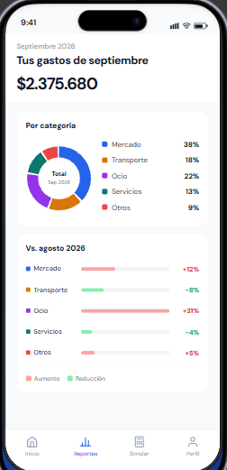

_Figura 5.8. Captura de la pantalla de reportes_

**Objetivo.** Mostrar en qué se fue el dinero del mes y cómo se compara con el mes anterior.

**Elementos.**

- Encabezado con el mes ("septiembre 2026"), el título "Tus gastos de septiembre" y el total del mes, \$2.375.680, en tamaño grande.
- Tarjeta **"Por categoría"** con un gráfico de dona que muestra en el centro el texto "Total · Sep 2026", acompañado de una leyenda con el color, el nombre y el porcentaje de cada categoría: Mercado 38%, Transporte 18%, Ocio 22%, Servicios 13% y Otros 9%.
- Tarjeta **"Vs. agosto 2026"** con una fila por categoría: el nombre con su color, una barra horizontal proporcional a la variación y el porcentaje de cambio. Los aumentos se muestran en rojo (Mercado +12%, Ocio +31%, Otros +5%) y las reducciones en verde (Transporte −8%, Servicios −4%). Una leyenda al final explica el significado de cada color.
- Barra de navegación con Reportes activo.

**Acciones.**

- Consultar la distribución y la variación de los gastos.
- Tocar una categoría para ver sus movimientos.
- Navegar a las demás secciones.

**Decisiones de diseño.** El gráfico de dona funciona bien para mostrar partes de un todo cuando son pocas categorías; con más de seis o siete se vuelve difícil de leer, por lo que las menos frecuentes se agrupan en "Otros". Las barras de comparación usan el rojo para los aumentos porque, en un contexto de gastos, gastar más es una señal de alerta. Además del color, cada fila muestra el signo y el porcentaje, para que la información no dependa solo del color y sea accesible para personas con dificultades para distinguirlos.

**Pantalla 9. Simulador de ahorro**

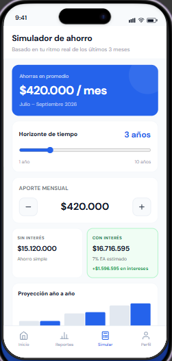

_Figura 5.9. Captura de la parte superior del simulador._

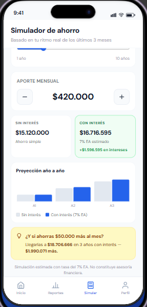
_Figura 5.10. Captura de la parte inferior del simulador._

**Objetivo.** Mostrar cuánto podría acumular el usuario si mantiene su ritmo de ahorro actual, y cuánto más si lo aumenta.

**Elementos.**

- Título "Simulador de ahorro" y el subtítulo "Basado en tu ritmo real de los últimos 3 meses".
- **Tarjeta azul** con el ahorro promedio: "\$420.000 / mes", calculado entre julio y septiembre de 2026.
- **Horizonte de tiempo:** control deslizante de 1 a 10 años, con el valor seleccionado (3 años) destacado en azul.
- **Aporte mensual:** el valor actual (\$420.000) con botones de menos y más para ajustarlo en pasos de \$50.000.
- **Dos tarjetas de resultado:**
  - "Sin interés": \$15.120.000, ahorro simple.
  - "Con interés", con fondo verde claro: \$16.716.595 al 7% efectivo anual estimado, con la ganancia destacada en verde: "+\$1.596.595 en intereses".
- **Gráfico "Proyección año a año"** con barras que comparan, para cada año, el ahorro sin interés (gris) y con interés (azul).
- **Sugerencia en amarillo** con un ícono de bombillo: "¿Y si ahorras \$50.000 más al mes? Llegarías a \$18.706.666 en 3 años con interés, \$1.990.071 más".
- Nota final: "Simulación estimada con tasa del 7% EA. No constituye asesoría financiera".
- Barra de navegación con Simular activo.

**Acciones.**

- Ajustar el horizonte de tiempo.
- Aumentar o disminuir el aporte mensual.
- Observar cómo se recalculan los resultados y el gráfico en tiempo real.

**Decisiones de diseño.** El simulador parte del ahorro real del usuario y no de una cifra que él mismo invente, lo que hace que la proyección sea creíble y personal. Los cálculos se actualizan en tiempo real al mover cualquier control, porque la intención es que el usuario explore y descubra por sí mismo el efecto de sus decisiones. Mostrar las cifras completas y no abreviadas (como "16,7M") evita malentendidos y hace más tangible el resultado. La sugerencia de ahorrar \$50.000 más plantea un cambio pequeño y alcanzable, y el aviso final deja claro que se trata de una estimación, no de una recomendación de inversión.

**Pantalla 10. Perfil _(por diseñar)_**

**Objetivo.** Concentrar la configuración de la cuenta, la seguridad y la privacidad.

**Especificación.**

- **Cabecera** con un avatar con las iniciales del usuario, su nombre, su correo y un botón para editar.
- **Tarjeta de estado de sincronización**, por ejemplo "Datos sincronizados hace 5 min" o "Sin conexión, 3 cambios pendientes".
- **Grupos de opciones:**
  - Cuenta: datos personales y cambio de contraseña.
  - Seguridad: desbloqueo con huella, bloqueo automático y sesiones activas.
  - Preferencias: alertas de presupuesto y categorías.
  - Privacidad: política de tratamiento de datos y términos.
- **Botón "Cerrar sesión".**
- **Enlace "Eliminar mi cuenta"** en rojo, que abre un diálogo de confirmación explicando que la acción es permanente.

**Decisiones de diseño.** La eliminación de cuenta se ubica al final y en rojo para que sea fácil de encontrar cuando se busca, pero difícil de activar por error. Además de ser una buena práctica, es un requisito de las tiendas de aplicaciones.

## 5.3 Estados de la interfaz

Una pantalla no se ve igual todo el tiempo. Además de su estado normal, con datos, cada pantalla debe contemplar qué mostrar mientras carga, cuando no tiene información, cuando algo falla y cuando no hay conexión. Diseñar estos estados desde el principio evita pantallas en blanco o mensajes técnicos que confunden al usuario.

| **Estado**               | **Cuando ocurre**                                                                | **Cómo se muestra**                                                                                                                                                                                                                                                           |
| ------------------------ | -------------------------------------------------------------------------------- | ----------------------------------------------------------------------------------------------------------------------------------------------------------------------------------------------------------------------------------------------------------------------------- |
| Cargando                 | Mientras se procesa la foto del recibo, se inicia sesión o se sincroniza.        | Los botones muestran un indicador de progreso y se deshabilitan para evitar toques repetidos. En listas y tarjetas se usan bloques grises animados con la forma del contenido (_skeleton_). En el OCR se muestra el mensaje "Leyendo tu recibo…".                             |
| Vacío                    | El usuario es nuevo o no tiene movimientos en el mes.                            | Una ilustración sencilla, un mensaje amable ("Aún no tienes movimientos este mes") y un botón que lleva directamente a registrar el primer gasto. En el simulador: "Necesitamos al menos un mes de datos para calcular tu ahorro".                                            |
| Error                    | Falla la lectura del recibo, un dato es inválido o hay credenciales incorrectas. | Mensajes en lenguaje claro que explican qué pasó y cómo seguir. En los campos, borde rojo y texto debajo. En errores generales, un banner rojo suave. Si falla el OCR: "No pudimos leer el recibo. Puedes ingresar el valor manualmente".                                     |
| Sin conexión             | El dispositivo no tiene internet.                                                | Un indicador discreto en la parte superior ("Sin conexión. Tus cambios se guardarán en el celular"). La aplicación sigue funcionando con normalidad. Solo se deshabilitan las acciones que requieren servidor, como iniciar sesión por primera vez o recuperar la contraseña. |
| Pendiente de sincronizar | Hay movimientos guardados localmente que aún no llegan a la nube.                | Un ícono pequeño de nube con reloj junto a cada movimiento pendiente, y el conteo de cambios pendientes en el perfil. Al sincronizar, el ícono desaparece sin interrumpir al usuario.                                                                                         |
| Éxito                    | Se guarda un gasto, se crea la cuenta o se cambia la contraseña.                 | Un mensaje breve en verde en la parte inferior ("Gasto guardado") que desaparece solo, sin exigir que el usuario lo cierre.                                                                                                                                                   |

## 5.4 Guía de estilo

La guía de estilo reúne las decisiones visuales que se aplican en toda la aplicación. Su propósito es mantener la consistencia entre pantallas y servir como referencia al implementar la interfaz en Flutter, donde estos valores se definirán como constantes del tema de la aplicación.

5.4.1 Paleta De Colores

| **Rol**          | **Color**                    | **Uso**                                                                                 |
| ---------------- | ---------------------------- | --------------------------------------------------------------------------------------- |
| Primario         | Azul #2563EB                 | Tarjeta principal, enlaces, elementos seleccionados, pestaña activa y datos destacados. |
| Acción principal | Gris muy oscuro #111827      | Botones principales: Iniciar sesión, Nuevo gasto, Continuar, Guardar gasto.             |
| Fondo            | Gris muy claro #F8FAFC       | Fondo general de las pantallas.                                                         |
| Superficie       | Blanco #FFFFFF               | Tarjetas, campos de texto y barra de navegación.                                        |
| Texto principal  | Gris muy oscuro #111827      | Títulos, montos y textos importantes.                                                   |
| Texto secundario | Gris medio #6B7280           | Subtítulos, fechas, categorías y descripciones.                                         |
| Éxito e ingresos | Verde #16A34A                | Ingresos, reducciones de gasto, confirmaciones y ganancias del simulador.               |
| Error y aumentos | Rojo #DC2626                 | Errores, aumentos de gasto y acciones destructivas.                                     |
| Alerta           | Fondo #FEF9C3, borde #FDE68A | Alertas de presupuesto y sugerencias.                                                   |

**Colores de categoría.** Cada categoría tiene un color propio que se mantiene en toda la aplicación, en los íconos de los movimientos, en el gráfico de dona y en la comparación mensual. Así el usuario asocia cada color con una categoría sin tener que leer:

- Mercado: azul
- Transporte: naranja
- Ocio: morado
- Servicios: verde azulado
- Otros: coral
- Ingresos: verde

**Justificación.** El azul transmite confianza y estabilidad, cualidades importantes en una aplicación financiera. Para la acción principal se eligió un tono casi negro en lugar del azul, para diferenciar claramente "lo que puedo hacer" de "la información que estoy viendo". El verde y el rojo siguen convenciones ampliamente reconocidas para ganancias y pérdidas, y se complementan siempre con signos (+ y −) para no depender solo del color.

5.4.2 Tipografía

Se utiliza una tipografía sans-serif geométrica, DM Sans o una similar, por su buena legibilidad en pantallas pequeñas y la claridad de sus números, algo fundamental en una aplicación donde casi todo son cifras.

| **Estilo**         | **Tamaño aproximado** | **Peso**        | **Uso**                                                   |
| ------------------ | --------------------- | --------------- | --------------------------------------------------------- |
| Monto principal    | 32 px                 | Negrita         | Disponible del mes, total de reportes, ahorro promedio.   |
| Título de pantalla | 22 px                 | Negrita         | "Simulador de ahorro", "Tus gastos de septiembre".        |
| Título de sección  | 16–18 px              | Semi negrita    | "Últimos movimientos", "Por categoría".                   |
| Cuerpo             | 14–15 px              | Regular / media | Nombres de movimientos, descripciones, textos de botones. |
| Texto secundario   | 12–13 px              | Regular         | Fechas, categorías, notas explicativas.                   |
| Etiqueta de campo  | 11 px, mayúsculas     | Semi negrita    | "CORREO ELECTRÓNICO", "VALOR DETECTADO".                  |

5.4.3 Iconografía

Se usan íconos de línea con un grosor uniforme y esquinas redondeadas, acordes con el estilo general de la interfaz. Los íconos de categoría se presentan dentro de un cuadrado de esquinas redondeadas con fondo pastel del color de la categoría. Los íconos siempre acompañan a un texto y no lo reemplazan, salvo en casos universalmente reconocidos como cerrar (X), volver (flecha) o mostrar contraseña (ojo).

5.4.4 Espaciado y forma

- **Retícula base de 8 px:** todos los márgenes y separaciones son múltiplos de 4 u 8 (8, 12, 16, 24 px). Esto da un ritmo visual ordenado y facilita la implementación.
- **Márgenes laterales** de 16 a 20 px en todas las pantallas.
- **Bordes redondeados:**
  - 16 px en la tarjeta principal.
  - 12 px en tarjetas, botones y campos.
  - 8 px en los chips.
- **Profundidad:** las tarjetas se separan del fondo con un borde gris muy sutil en lugar de sombras marcadas, lo que mantiene la interfaz limpia.

5.4.5 Componentes reutilizables

| Componente                   | Descripción                                                                                                                        | Dónde se usa                                                      |
| ---------------------------- | ---------------------------------------------------------------------------------------------------------------------------------- | ----------------------------------------------------------------- |
| Botón principal              | Fondo oscuro, texto blanco, ancho completo, 48–52 px de alto. Estados: normal, presionado, cargando y deshabilitado (gris).        | Todas las pantallas con una acción principal.                     |
| Botón secundario             | Fondo blanco con borde gris.                                                                                                       | Google y Apple, Cerrar sesión, Usar PIN.                          |
| Campo de texto               | Etiqueta en mayúsculas arriba, fondo blanco, borde gris. Borde azul al enfocar y rojo con mensaje de error cuando hay un problema. | Formularios de autenticación, valor y nota del gasto.             |
| Tarjeta                      | Fondo blanco, esquinas de 12 px y borde sutil.                                                                                     | Movimientos, reportes, controles del simulador.                   |
| Tarjeta de movimiento        | Ícono de categoría, nombre, categoría y fecha, y monto a la derecha con color según el tipo.                                       | Inicio e historial.                                               |
| Tarjeta seleccionable        | Tarjeta con ícono, título, descripción e indicador tipo radio; borde azul al seleccionarse.                                        | Nuevo gasto.                                                      |
| Chip                         | Etiqueta seleccionable con borde; al seleccionarse, fondo azul claro y borde azul.                                                 | Categorías en Confirma los datos.                                 |
| Banner                       | Franja con ícono, título y texto, en variantes de alerta (amarillo), éxito (verde) y error (rojo).                                 | Alerta de presupuesto, recibo leído, errores de inicio de sesión. |
| Selector de pestañas         | Dos opciones en un contenedor gris; la activa con fondo blanco.                                                                    | Inicio de sesión / Registro.                                      |
| Barra de navegación inferior | Cuatro pestañas con ícono y etiqueta; la activa en azul.                                                                           | Inicio, Reportes, Simulador, Perfil.                              |

## 5.5 Principios de diseño móvil aplicados

El diseño de MisLukas se basa en principios reconocidos de diseño de interfaces móviles, tomados principalmente de las guías de Material Design (Google) y Human Interface Guidelines (Apple), y de las heurísticas de usabilidad de Jakob Nielsen. A continuación, explicamos cómo se aplica cada uno.

**Zonas táctiles adecuadas.** Los dedos son mucho menos precisos que un cursor. Material Design recomienda áreas táctiles de al menos 48 × 48 dp y Apple de 44 × 44 pt. En MisLukas, todos los elementos interactivos (botones, chips, tarjetas de movimiento, íconos del encabezado y pestañas) cumplen como mínimo 48 dp, incluso cuando el ícono visible es más pequeño.

**Acción principal al alcance del pulgar.** La mayoría de personas usa el celular con una mano, y la zona inferior de la pantalla es la más fácil de alcanzar con el pulgar. Por eso los botones principales (Nuevo gasto, Continuar, Guardar gasto, Iniciar sesión) y la barra de navegación se ubican en la parte inferior. Los elementos de la parte superior, como cerrar o volver, son acciones menos frecuentes.

**Jerarquía visual.** Cada pantalla tiene un elemento dominante que responde a su propósito: el disponible en Inicio, el valor detectado en Confirma los datos, el total en Reportes y el ahorro promedio en el Simulador. Se destacan con tamaño, peso y color, mientras que la información de apoyo usa tamaños menores y tonos grises. Así el usuario entiende lo más importante sin leer toda la pantalla.

**Feedback inmediato.** El usuario siempre debe saber qué está pasando, lo que corresponde a la heurística de visibilidad del estado del sistema. En MisLukas esto se refleja en:

Los requisitos de contraseña que se marcan mientras se escribe.

El banner "Recibo leído correctamente" después del OCR.

El recálculo instantáneo del simulador.

El mensaje "Gasto guardado" al terminar un registro.

Los indicadores de carga y de sincronización pendiente.

**Prevención de errores.** Es mejor evitar un error que explicarlo después. Por eso:

El botón "Crear cuenta" permanece deshabilitado hasta que el formulario es válido.

El valor detectado por el OCR siempre puede corregirse antes de guardar.

La eliminación de cuenta pide confirmación.

El campo de valor solo acepta números.

**Consistencia.** Los mismos componentes se comportan igual en todas las pantallas: un chip seleccionado siempre se ve igual, el botón principal siempre está abajo y los ingresos siempre son verdes. Esto reduce lo que el usuario tiene que aprender y le da confianza.

**Reconocer antes que recordar.** Las categorías se eligen con chips visibles en lugar de escribirse, cada una tiene su propio ícono y color, y las opciones de registro incluyen una descripción. El usuario no necesita memorizar nada para usar la aplicación.

**Accesibilidad.**

El contraste entre texto y fondo cumple la relación mínima de 4,5:1 de las pautas WCAG 2.1 nivel AA.

La interfaz se adaptará al tamaño de texto configurado en el sistema.

La información nunca depende solo del color: los montos llevan signo y las variaciones, porcentaje.

Los íconos y botones tendrán etiquetas para lectores de pantalla (TalkBack y VoiceOver).

## 5.6 estados de los bocetos

Los bocetos presentados son **prototipos de alta fidelidad construidos en Figma**. Representan la apariencia y el flujo previstos de la aplicación, pero no son la aplicación final: su propósito es validar el diseño antes de invertir tiempo en desarrollo. Los datos que muestran (nombres, montos, comercios) son ficticios. Durante la implementación en Flutter, el diseño puede ajustarse según lo que se aprenda en las pruebas con usuarios y según las particularidades de cada sistema operativo.

Estado actual de las pantallas:

| **Pantalla**                                 | **Estado**                        |
| -------------------------------------------- | --------------------------------- |
| 1\. Inicio de sesión                         | Boceto terminado                  |
| 2\. Registro                                 | Boceto terminado                  |
| 3\. Recuperar contraseña                     | Especificada, pendiente de boceto |
| 4\. Desbloqueo                               | Especificada, pendiente de boceto |
| 5\. Inicio                                   | Boceto terminado                  |
| 6\. Nuevo gasto                              | Boceto terminado                  |
| 7\. Confirma los datos (con recibo y manual) | Boceto terminado                  |
| 8\. Reportes                                 | Boceto terminado                  |
| 9\. Simulador de ahorro                      | Boceto terminado                  |
| 10\. Perfil                                  | Especificada, pendiente de boceto |
