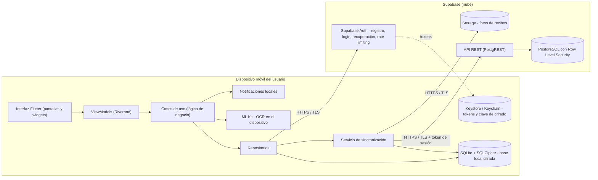
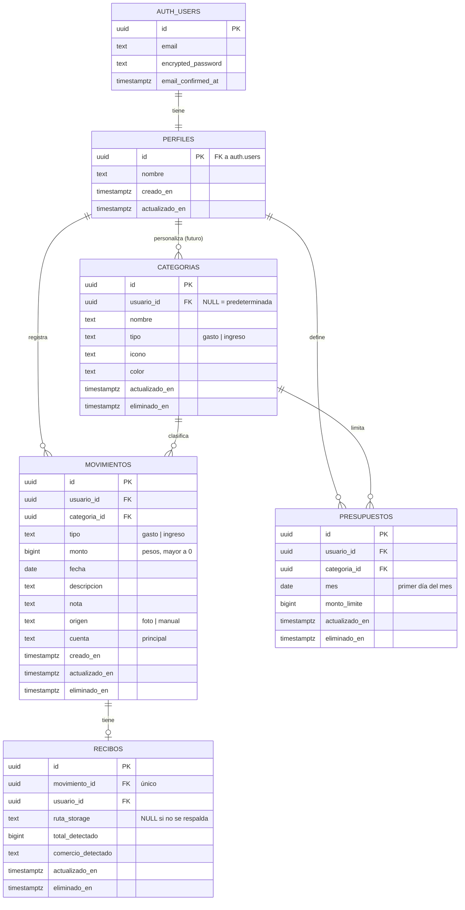

# 6. arquitectura de la aplicación

La arquitectura de MisLukas responde a tres exigencias que salen directamente de las secciones anteriores:

- **Funcionar sin internet.** El usuario debe poder registrar un gasto en cualquier lugar (RNF-09).
- **Proteger datos financieros.** Tanto en el dispositivo como en el servidor (RNF-01 a RNF-08).
- **Crecer sin rehacer lo construido.** Las funcionalidades futuras de la sección 4.2 deben poder agregarse sobre la misma base (RNF-28).

Esta sección explica las tecnologías elegidas, cómo se conectan entre sí, cómo se organiza el código, cómo se modelan y almacenan los datos, y cómo se sincroniza la información entre el celular y la nube.

## 6.1 Stack tecnológico

| Capa                    | Tecnología                    | Función en MisLukas                                                                |
| ----------------------- | ----------------------------- | ---------------------------------------------------------------------------------- |
| Framework               | Flutter (Dart)                | Construcción de la aplicación para Android e iOS desde un solo código              |
| Manejo de estado        | Riverpod                      | Conexión entre la interfaz y la lógica, inyección de dependencias                  |
| Base de datos local     | Drift (SQLite) + SQLCipher    | Almacenamiento cifrado de movimientos, categorías y presupuestos en el dispositivo |
| Backend                 | Supabase                      | Autenticación, base de datos PostgreSQL en la nube y almacenamiento de archivos    |
| Almacenamiento seguro   | flutter_secure_storage        | Tokens de sesión y clave de cifrado de la base local                               |
| Reconocimiento de texto | google_mlkit_text_recognition | Lectura de recibos en el propio dispositivo                                        |
| Cámara y galería        | camera / image_picker         | Captura o selección de la foto del recibo                                          |
| Notificaciones          | flutter_local_notifications   | Alertas de presupuesto                                                             |
| Conectividad            | connectivity_plus             | Detección de conexión para iniciar la sincronización                               |
| Biometría               | local_auth                    | Desbloqueo con huella, rostro o PIN del sistema                                    |
| Cliente del backend     | supabase_flutter              | Comunicación con Supabase desde la aplicación                                      |

Justificación de cada elección

Flutter. Evaluamos tres opciones: desarrollo nativo (Kotlin para Android y Swift para iOS), React Native y Flutter.

El desarrollo nativo ofrece el mejor acceso al sistema operativo, pero obliga a mantener dos proyectos con dos lenguajes, algo que un equipo pequeño no puede sostener.

Entre las opciones multiplataforma, elegimos Flutter porque dibuja su propia interfaz en lugar de depender de los componentes de cada sistema. Así la aplicación se ve igual en Android y en iOS, lo que facilita respetar fielmente los bocetos de la sección 5.

Además, Dart se compila a código nativo, lo que favorece el rendimiento en las animaciones y en el recálculo instantáneo del simulador (RNF-15).

Flutter cuenta con paquetes maduros para todas las funciones del dispositivo que necesitamos.

Riverpod. Consideramos Riverpod y BLoC, las dos opciones más usadas en proyectos Flutter de este tamaño.

BLoC impone una separación estricta entre eventos y estados, muy útil en equipos grandes, pero exige escribir mucho código repetitivo para cada funcionalidad.

Riverpod ofrece la misma separación entre interfaz y lógica con menos código, detecta errores de dependencias en tiempo de compilación y funciona también como sistema de inyección de dependencias. Esto último simplifica las pruebas, porque permite reemplazar un repositorio real por uno falso sin modificar el resto del código.

Para un equipo pequeño y un MVP, Riverpod es la opción más equilibrada.

Drift con SQLCipher. La base local guarda la información financiera del usuario, por lo que necesitábamos consultas por fecha y categoría, relaciones entre tablas y cifrado.

Drift es una capa sobre SQLite que genera código Dart a partir de la definición de las tablas. Las consultas se validan en tiempo de compilación, siempre se ejecutan de forma parametrizada (lo que previene la inyección SQL, RNF-07), incluye un sistema de migraciones para cambiar el esquema sin perder datos y permite observar consultas como flujos. Esto último hace que la pantalla de inicio se actualice automáticamente cuando se guarda un gasto.

SQLCipher cifra todo el archivo de la base de datos, de modo que si alguien extrae el archivo del dispositivo no puede leerlo sin la clave (RNF-04).

Se descartaron Hive e Isar, bases de datos no relacionales, porque el modelo de MisLukas es relacional por naturaleza: un movimiento pertenece a una categoría, un presupuesto a una categoría y a un mes. Además, los reportes requieren agregaciones que SQL resuelve de forma directa.

Supabase. Las alternativas evaluadas fueron Firebase, Supabase y una API propia.

Firebase es muy completo, pero su base de datos (Firestore) no es relacional y su modelo de consultas se ajusta peor a los reportes por categoría y mes.

Una API propia daría control total, pero implicaría construir y mantener desde cero la autenticación, la recuperación de contraseñas, los límites de intentos y la infraestructura. Es demasiado para un MVP y además aumenta el riesgo de cometer errores de seguridad en las partes más delicadas.

Supabase ofrece:

Una base de datos PostgreSQL, relacional y coherente con el esquema local.

Un servicio de autenticación con verificación de correo, recuperación de contraseña y límites de intentos incluidos.

Autorización a nivel de fila con Row Level Security.

Almacenamiento de archivos y soporte para inicio de sesión con Google y Apple.

Un cliente oficial para Flutter.

Es la opción que mejor equilibra seguridad, rapidez de desarrollo y coherencia con el modelo de datos.

flutter_secure_storage. Guarda la información en el almacenamiento protegido del sistema operativo: el Keystore en Android y el Keychain en iOS. Allí se guardan los tokens de sesión y la clave de cifrado de la base local (RNF-05).

google_mlkit_text_recognition. Procesa la imagen del recibo en el propio dispositivo, sin enviarla a ningún servidor. Esto tiene tres ventajas:

La lectura funciona sin conexión (RF-15).

La foto del recibo no sale del celular para ser procesada, lo que protege la privacidad del usuario.

No depende de la velocidad de la red, lo que ayuda a cumplir el tiempo de lectura de RNF-13.

camera e image_picker. El primero permite una vista de cámara integrada en la aplicación; el segundo permite elegir una foto ya tomada desde la galería. Tener ambas opciones cubre el caso de quien fotografía el recibo en el momento y el de quien lo fotografió antes.

flutter_local_notifications. Las alertas de presupuesto se calculan en el dispositivo a partir de los datos locales, por lo que se usan notificaciones locales en lugar de notificaciones enviadas desde un servidor. Así las alertas funcionan también sin conexión.

connectivity_plus. Informa cuando cambia el estado de la red, lo que permite iniciar la sincronización automáticamente al recuperar la conexión (RF-25).

local_auth. Utiliza la autenticación biométrica del propio sistema operativo. La aplicación nunca tiene acceso a la huella ni al rostro del usuario: solo recibe del sistema una respuesta de éxito o fallo.

## 6.2 arquitectura general

La aplicación sigue un modelo cliente-servidor con enfoque offline-first. El dispositivo no es un simple visor de datos que están en la nube: es la fuente de trabajo principal, y la nube funciona como respaldo, punto de sincronización y responsable de la identidad del usuario.



Figura 6.1. Arquitectura general de MisLukas

**Funcionamiento general.**

1. **Primera vez.** El usuario se registra o inicia sesión contra Supabase Auth. Este servicio valida las credenciales, aplica los límites de intentos y entrega un token de acceso y un token de renovación. Ambos se guardan en el almacenamiento seguro del dispositivo.
2. **Uso diario.** Todas las lecturas y escrituras se hacen sobre la base local cifrada. Registrar un gasto, consultar los reportes o usar el simulador no requiere conexión y responde de inmediato.
3. **Sincronización.** Cuando hay conexión, el servicio de sincronización envía a Supabase los cambios pendientes y descarga los cambios hechos desde otros dispositivos. Cada solicitud lleva el token del usuario, y PostgreSQL, mediante Row Level Security, garantiza que solo pueda leer y escribir sus propios registros.
4. **Procesamiento local.** El reconocimiento de texto y las alertas de presupuesto se resuelven en el dispositivo, sin intervención del servidor.

**Por qué este modelo.** Una aplicación que depende del servidor para cada acción sería lenta con mala señal e inútil sin datos, justo en los momentos en que el usuario necesita registrar un gasto: en el bus, en el supermercado o en la calle. Una aplicación solo local sería rápida, pero no podría autenticar de forma segura, recuperar contraseñas ni conservar los datos si el celular se pierde. El modelo híbrido toma lo mejor de ambos: la rapidez y disponibilidad de lo local, y la seguridad y el respaldo del servidor.

## 6.3 Arquitectura interna de la aplicación

6.3.1 Clean Architecture con MVVM

El código de la aplicación se organiza siguiendo los principios de Clean Architecture, combinados con el patrón MVVM (Model-View-ViewModel) en la capa de presentación. La idea central es que cada capa tiene una responsabilidad única y que las dependencias apuntan hacia adentro: la interfaz depende de la lógica de negocio, pero la lógica de negocio no sabe nada de la interfaz ni de dónde se guardan los datos.

```text
┌─────────────────────────────────────────────────────────┐
│  PRESENTACIÓN                                           │
│  Views (pantallas y widgets de Flutter)                 │
│  ViewModels (Notifiers de Riverpod)                     │
└───────────────────────────┬─────────────────────────────┘
                            │ llama a
┌───────────────────────────▼─────────────────────────────┐
│  DOMINIO                                                │
│  Entidades (Movimiento, Categoría, Presupuesto…)        │
│  Casos de uso (RegistrarGasto, CalcularDisponible…)     │
│  Interfaces de repositorios (contratos)                 │
└───────────────────────────▲─────────────────────────────┘
                            │ implementa
┌───────────────────────────┴─────────────────────────────┐
│  DATOS                                                  │
│  Implementación de repositorios                         │
│  Fuente local (Drift / SQLite)                          │
│  Fuente remota (Supabase)                               │
│  Servicio de sincronización                             │
└─────────────────────────────────────────────────────────┘
```

Figura 6.2. Capas de la arquitectura interna.

**Capa de presentación.** Contiene lo que el usuario ve y toca.

- Las **Views** son los widgets de Flutter que dibujan cada pantalla. No contienen lógica: solo muestran el estado que reciben y avisan cuando el usuario hace algo.
- Los **ViewModels**, implementados como _Notifiers_ de Riverpod, reciben esas acciones, llaman a los casos de uso correspondientes y exponen a la vista un estado listo para mostrar: cargando, con datos, vacío o con error. Así los estados de la sección 5.3 se representan de forma explícita en el código.

**Capa de dominio.** Es el núcleo de la aplicación y está escrita en Dart puro, sin depender de Flutter, de Drift ni de Supabase.

- Las **entidades** representan los conceptos del negocio.
- Los **casos de uso** implementan cada operación del sistema, por ejemplo:
  - RegistrarMovimiento
  - CalcularDisponibleDelMes
  - EvaluarAlertasDePresupuesto
  - SimularAhorro
  - SugerirCategoria
- Las **interfaces de repositorios** definen qué operaciones de datos se necesitan, sin decir cómo se implementan.

Como esta capa no depende de nada externo, es la más fácil de probar, y es donde se concentra la cobertura de pruebas exigida en RNF-29.

**Capa de datos.** Implementa las interfaces definidas en el dominio.

- Cada repositorio decide de dónde obtiene la información: en MisLukas, siempre de la **fuente local**, y registra los cambios para que el **servicio de sincronización** los envíe a la **fuente remota** cuando haya conexión.
- Si en el futuro se cambiara Supabase por otro backend, solo habría que modificar esta capa.

**Ejemplo del recorrido de una acción.** Cuando Camila toca "Guardar gasto":

1. La vista avisa al ConfirmarGastoViewModel.
2. El ViewModel llama al caso de uso RegistrarMovimiento, que valida que el valor sea mayor que cero (RF-20) y crea la entidad Movimiento.
3. El caso de uso le pide al MovimientoRepository que la guarde.
4. El repositorio la escribe en SQLite con estado "pendiente" y la agrega a la cola de sincronización.
5. Luego el caso de uso llama a EvaluarAlertasDePresupuesto, que revisa si la categoría superó el 75% del límite y, si es así, genera la alerta y la notificación.
6. La pantalla de inicio, que observa la base local, se actualiza automáticamente.

En ningún momento la interfaz habló con la base de datos ni con Supabase.

6.3.2 Estructura de carpetas

El proyecto se organiza por funcionalidad (_feature-first_) y, dentro de cada funcionalidad, por capas. Esta organización mantiene juntos todos los archivos relacionados con una misma función, lo que facilita trabajar en paralelo y agregar funcionalidades nuevas sin afectar las existentes.

```text
lib/
├── main.dart                     # Punto de entrada: inicializa Supabase, la base local y Riverpod
├── app.dart                      # MaterialApp, tema y rutas
├── core/                         # Código compartido por toda la app
│   ├── config/                   # Variables de entorno (URL y clave pública de Supabase)
│   ├── theme/                    # Colores, tipografía y espaciado de la guía de estilo
│   ├── widgets/                  # Componentes reutilizables: botones, tarjetas, chips, banners
│   ├── security/                 # Almacenamiento seguro, biometría, manejo de la clave de cifrado
│   ├── database/                 # Definición de Drift, tablas, migraciones
│   ├── sync/                     # Servicio y cola de sincronización
│   ├── network/                  # Detección de conectividad
│   ├── errors/                   # Tipos de error y mensajes para el usuario
│   └── utils/                    # Formato de moneda COP, fechas, validaciones
└── features/
    ├── auth/                     # Registro, login, recuperación, desbloqueo
    │   ├── data/                 # AuthRepositoryImpl, fuente remota Supabase Auth
    │   ├── domain/               # Entidad Usuario, casos de uso, interfaz AuthRepository
    │   └── presentation/         # Pantallas, widgets y ViewModels
    ├── movements/                # Inicio, nuevo gasto, confirmación, OCR, historial
    │   ├── data/
    │   ├── domain/
    │   └── presentation/
    ├── budgets/                  # Categorías, presupuestos y alertas
    ├── reports/                  # Reportes por categoría y comparación mensual
    ├── simulator/                # Simulador de ahorro
    └── profile/                  # Perfil, seguridad, eliminación de cuenta
test/                             # Pruebas unitarias y de widgets, con la misma estructura de lib/
supabase/
└── migrations/                   # Scripts SQL: tablas, políticas RLS, triggers
```

Guardar los scripts de la base de datos remota dentro del mismo repositorio permite versionar el esquema del servidor junto con el código de la aplicación, y recrear el entorno de forma idéntica en desarrollo y en producción.

## 6.4 Modelo de datos

6.4.1 Entidades

**Usuario / Perfil.** Supabase Auth administra internamente la identidad del usuario: correo, contraseña con hash y verificación. MisLukas no guarda credenciales en sus propias tablas. La tabla perfiles solo almacena los datos que la aplicación necesita y comparte su identificador con el usuario de Supabase Auth.

**Categoría.** Clasifica los movimientos. Las categorías predeterminadas (Mercado, Transporte, Ocio, Servicios, Restaurantes, Otros e Ingreso) son comunes a todos los usuarios y tienen el campo usuario_id vacío. La tabla está preparada para categorías personalizadas en el futuro, que llevarán el usuario_id de su dueño.

**Movimiento.** Es la entidad central. Representa un gasto o un ingreso, con su valor, fecha, categoría, descripción, nota opcional y origen del registro (foto o manual). Incluye un campo cuenta con el valor por defecto "principal", reservado para el manejo de varias cuentas en el futuro.

**Presupuesto.** Define el límite mensual de gasto para una categoría. Existe como máximo un presupuesto por usuario, categoría y mes.

**Recibo.** Guarda la información asociada a un movimiento registrado por foto: la ubicación de la imagen, el total y el comercio detectados por el OCR. Se separa del movimiento porque no todos los movimientos tienen recibo, y porque la imagen tiene un manejo de privacidad distinto: el usuario decide si se conserva y si se respalda en la nube.

**Sesión y dispositivo.** Las sesiones las administra Supabase Auth en su propio esquema interno, incluida la invalidación de sesiones después de un cambio de contraseña (RF-10). En el dispositivo, la sesión se representa por los tokens guardados en el almacenamiento seguro. Por eso MisLukas no necesita una tabla propia de sesiones en el MVP. Si en el futuro se muestra la lista detallada de dispositivos conectados, se agregará una tabla dispositivos.

**Decisiones transversales del modelo:**

- **Identificadores UUID** generados en el dispositivo. Esto permite crear registros sin conexión sin riesgo de que dos dispositivos generen el mismo identificador, y es la base para evitar duplicados en la sincronización (RF-26).
- **Montos como números enteros** en pesos, con el tipo BIGINT. El peso colombiano se maneja en la práctica sin decimales, y los números de punto flotante producen errores de redondeo que son inaceptables en una aplicación financiera.
- **Borrado lógico** mediante el campo eliminado_en. Cuando el usuario elimina un movimiento, el registro no desaparece de inmediato, sino que se marca como eliminado. Así la eliminación también se puede sincronizar a los demás dispositivos; un registro borrado físicamente simplemente dejaría de existir sin que nadie más se enterara.
- **Marcas de tiempo** creado_en y actualizado_en en todas las tablas, necesarias para la sincronización y la resolución de conflictos.

6.4.2 Diagrama entidad-relación



Figura 6.3. Diagrama entidad-relación del esquema remoto.

**Reglas de integridad principales:**

- monto y monto_limite deben ser mayores que cero, validado con restricciones CHECK en la base de datos.
- tipo solo admite los valores "gasto" o "ingreso", y origen solo "foto" o "manual".
- La combinación de usuario_id, categoria_id y mes es única en presupuestos.
- Un movimiento tiene como máximo un recibo, por eso movimiento_id es único en recibos.

Estas reglas se aplican en la base de datos además de validarse en la aplicación. La validación en la app mejora la experiencia del usuario; la validación en la base de datos garantiza que ningún dato inválido llegue a guardarse, aunque alguien intente enviarlo directamente a la API.

6.4.3 Diferencias entre el esquema local y el remoto

Ambos esquemas comparten las mismas tablas y campos de negocio, pero cumplen funciones distintas, por lo que cada uno tiene elementos propios.

| Aspecto                  | Esquema local (SQLite en el dispositivo)                               | Esquema remoto (PostgreSQL en Supabase)                                                  |
| ------------------------ | ---------------------------------------------------------------------- | ---------------------------------------------------------------------------------------- |
| Propósito                | Base de trabajo diaria, siempre disponible                             | Respaldo, sincronización entre dispositivos e identidad                                  |
| Usuarios                 | Solo los datos del usuario que inició sesión                           | Datos de todos los usuarios, aislados por RLS                                            |
| Tabla de usuarios        | No guarda credenciales; solo el perfil                                 | auth.users administrada por Supabase Auth, más perfiles                                  |
| Campos de sincronización | estado_sync en cada registro: sincronizado, pendiente o error          | sincronizado_en: momento en que el servidor recibió el cambio, asignado por un _trigger_ |
| Tablas adicionales       | cola_sincronizacion y metadatos_sync (última sincronización por tabla) | Ninguna adicional en el MVP                                                              |
| Recibos                  | ruta_local: ubicación de la imagen en el celular                       | ruta_storage: ubicación en Supabase Storage, solo si el usuario activa el respaldo       |
| Seguridad                | Archivo cifrado completo con SQLCipher                                 | Row Level Security en todas las tablas y cifrado gestionado por Supabase                 |
| Tipos de datos           | UUID y fechas se guardan como texto; montos como INTEGER               | Tipos nativos uuid, date, timestamptz, bigint                                            |
| Migraciones              | Gestionadas por Drift al actualizar la app                             | Scripts SQL versionados en supabase/migrations                                           |

El campo sincronizado_en merece una explicación. Los relojes de los celulares no siempre están en hora, por lo que depender solo de la fecha del dispositivo para saber qué cambios descargar podría hacer que algunos se pierdan. Por eso, cuando un registro llega al servidor, un _trigger_ de PostgreSQL le asigna la hora del servidor. Al descargar cambios, la app pide "todo lo modificado en el servidor desde mi última sincronización", usando siempre el reloj del servidor como referencia.

## 6.5 Almacenamiento de datos: modelo híbrido

MisLukas guarda información en cuatro lugares distintos, cada uno elegido según el tipo de dato, su sensibilidad y su necesidad de estar disponible sin conexión.

| Dato                                                    | Dónde se guarda                                                     | Por qué                                                                              |
| ------------------------------------------------------- | ------------------------------------------------------------------- | ------------------------------------------------------------------------------------ |
| Movimientos, categorías, presupuestos, datos de recibos | SQLite cifrado en el dispositivo                                    | Deben estar disponibles siempre, sin conexión y con respuesta inmediata              |
| Copia de todo lo anterior                               | PostgreSQL en Supabase                                              | Respaldo ante pérdida del celular y sincronización entre dispositivos                |
| Fotos de recibos                                        | Almacenamiento interno de la app y, opcionalmente, Supabase Storage | Son archivos, no datos estructurados; su respaldo en la nube es decisión del usuario |
| Tokens de sesión y clave de cifrado                     | Keystore (Android) / Keychain (iOS)                                 | Son credenciales; requieren la máxima protección que ofrece el sistema operativo     |
| Preferencias no sensibles (tema, última pestaña)        | Almacenamiento clave-valor                                          | Datos simples sin valor para un atacante                                             |

**SQLite local como base de trabajo diaria.** Es la única fuente que consulta la interfaz. Esto garantiza que la experiencia sea la misma con o sin conexión y que las pantallas respondan en milisegundos. El archivo está cifrado con SQLCipher mediante una clave aleatoria de 256 bits que se genera la primera vez que el usuario inicia sesión en ese dispositivo y se guarda en el almacenamiento seguro. Al cerrar sesión o eliminar la cuenta, se borran el archivo y la clave (RF-13).

**PostgreSQL en Supabase como respaldo y sincronización.** Contiene una copia de los datos de cada usuario, protegida por Row Level Security. Es lo que permite que Camila recupere toda su información al cambiar de celular (escenario 6 de la sección 3.3) y que en el futuro pueda usar la aplicación en más de un dispositivo.

**Storage para las fotos de recibos.** Por defecto, la foto del recibo se guarda solo en el almacenamiento interno de la aplicación, al que otras apps no tienen acceso. Si el usuario activa la opción de respaldar recibos, la imagen se sube a un _bucket_ privado de Supabase Storage, en una carpeta con el identificador del usuario, y una política de acceso impide que otro usuario pueda verla. Hacer este respaldo opcional responde al principio de minimización: una foto de un recibo puede revelar dónde compra una persona, a qué hora y con qué medio de pago.

**Almacenamiento seguro para los tokens.** El token de acceso permite hacer solicitudes en nombre del usuario, y el token de renovación permite obtener nuevos tokens de acceso. Si alguien los obtiene, puede suplantar al usuario. Por eso se guardan exclusivamente en el Keystore o el Keychain, donde están cifrados por el propio sistema y protegidos del acceso de otras aplicaciones.

**Por qué no localStorage ni SharedPreferences para datos financieros.** Esta es una duda frecuente, por lo que conviene aclararla:

- localStorage es una tecnología de los navegadores web. No existe como tal en una aplicación móvil nativa o de Flutter.
- Sus equivalentes móviles son SharedPreferences en Android y UserDefaults en iOS. Son almacenes simples de pares clave-valor, pensados para configuraciones pequeñas, y no son adecuados para los datos de MisLukas por cuatro razones:
  1. **No están cifrados.** Guardan los datos en archivos de texto dentro de la aplicación que, en un dispositivo comprometido o mediante una copia de seguridad, pueden leerse directamente.
  2. **No permiten consultas.** Calcular el gasto de mercado de septiembre exigiría cargar todos los movimientos en memoria y filtrarlos a mano, algo ineficiente a medida que crece el historial.
  3. **No manejan relaciones ni integridad.** No hay forma de garantizar que un movimiento apunte a una categoría válida o que un monto sea positivo.
  4. **No son transaccionales.** Si la aplicación se cierra en medio de una escritura, los datos pueden quedar incompletos o corruptos.

Por eso en MisLukas el almacenamiento clave-valor se limita a preferencias sin valor para un atacante, y todo dato financiero o credencial se guarda en la base cifrada o en el almacenamiento seguro.

## 6.6 Funcionamiento offline y sincronización

6.6.1 Estrategia offline-first

En una aplicación tradicional, la nube es la fuente de verdad y el dispositivo solo muestra lo que el servidor responde. En MisLukas es al revés: **el usuario trabaja siempre contra su base local** y la sincronización ocurre en segundo plano, sin bloquearlo ni hacerlo esperar. La conexión a internet deja de ser un requisito para usar la aplicación y pasa a ser una condición para respaldar y compartir la información entre dispositivos.

6.6.2 Mecanismo de sincronización

La sincronización se basa en cuatro elementos:

**1\. Identificadores generados en el dispositivo.** Cada registro nace con un UUID creado en el celular. Cuando se envía al servidor, se usa una operación _upsert_ (insertar o actualizar): si el identificador no existe, se crea; si ya existe, se actualiza. Así, aunque un envío se repita por una falla de red, nunca se duplica el registro (RF-26).

**2\. Marcas de tiempo.** Cada modificación actualiza el campo actualizado_en. En el servidor, el _trigger_ asigna además sincronizado_en con la hora del servidor.

**3\. Estado de sincronización.** Cada registro local tiene un campo estado_sync con uno de tres valores:

- sincronizado: coincide con el servidor.
- pendiente: tiene cambios que aún no se envían.
- error: el servidor lo rechazó, por ejemplo por un dato inválido. Se reintenta y, si el error persiste, se informa al usuario.

**4\. Cola de sincronización.** Cada creación, modificación o eliminación agrega una entrada a la tabla local cola_sincronizacion, con la tabla afectada, el identificador del registro, la operación, la fecha y el número de intentos. La cola conserva el orden de las operaciones y sobrevive al cierre de la aplicación (RNF-11).

**Proceso de sincronización.** Se ejecuta al abrir la app, al recuperar la conexión y periódicamente mientras la app está abierta:

1. **Verificar la sesión.** Si el token de acceso expiró, se renueva con el token de renovación. Si la renovación falla, la sincronización se pospone y los datos siguen seguros en el dispositivo.
2. **Enviar (_push_).** Se recorren las entradas de la cola en orden y se envían al servidor con _upsert_. Cada entrada confirmada se elimina de la cola y el registro pasa a sincronizado. Si una falla por la red, se detiene el proceso y se reintenta más tarde con esperas crecientes.
3. **Recibir (_pull_).** Se consultan los registros con sincronizado_en posterior a la última sincronización guardada en metadatos_sync, y se aplican a la base local.
4. **Registrar el avance.** Se actualiza la fecha de última sincronización y el indicador del perfil (RF-47).

El envío se hace antes de la recepción para que los cambios locales del usuario lleguen primero al servidor y no sean sobrescritos por una versión anterior durante la descarga.

6.6.3 Resolución de conflictos

Un conflicto ocurre cuando el mismo registro se modifica en dos lugares antes de sincronizarse, por ejemplo, en dos dispositivos distintos. MisLukas aplica la estrategia **"la última escritura gana"** (_last-write-wins_) a nivel de registro: al recibir un cambio del servidor, se compara su actualizado_en con el de la versión local, y se conserva la más reciente. Si la versión local es más nueva y está pendiente, se mantiene y se enviará en la siguiente sincronización.

Se añaden dos reglas complementarias:

- **La eliminación prevalece.** Si un registro fue eliminado en un lugar y modificado en otro, se respeta la eliminación. Resulta más confuso para el usuario ver reaparecer un gasto que borró que perder una edición menor.
- **Los registros nuevos nunca entran en conflicto**, porque sus identificadores son únicos por construcción.

**Por qué esta estrategia es suficiente para el MVP.** Los datos de MisLukas son personales: cada registro pertenece a un solo usuario, que en la mayoría de los casos usa un solo celular. Los conflictos reales son poco frecuentes y, cuando ocurren, afectan a un movimiento puntual que el usuario puede corregir fácilmente. Estrategias más elaboradas, como la fusión campo por campo o los CRDT, agregarían una complejidad que no se justifica en esta etapa. Reconocemos como limitación que "la última escritura gana" depende del reloj de los dispositivos; si en el futuro el uso en varios dispositivos se vuelve común, se evaluará la fusión por campo.

6.6.4 Qué funciona sin internet y qué no

| Funcionalidad                              | Sin conexión | Motivo                                                                      |
| ------------------------------------------ | ------------ | --------------------------------------------------------------------------- |
| Desbloquear la app con biometría o PIN     | Sí           | Se valida en el dispositivo                                                 |
| Ver disponible, movimientos y alertas      | Sí           | Datos en la base local                                                      |
| Registrar gasto por foto (incluido el OCR) | Sí           | ML Kit procesa en el dispositivo                                            |
| Registrar gasto o ingreso manual           | Sí           | Se guarda localmente como pendiente                                         |
| Editar o eliminar movimientos              | Sí           | Se registra en la cola de sincronización                                    |
| Reportes y simulador                       | Sí           | Se calculan con los datos locales                                           |
| Notificaciones de presupuesto              | Sí           | Son notificaciones locales                                                  |
| Primer inicio de sesión en un dispositivo  | No           | Requiere validar las credenciales con Supabase Auth                         |
| Registro de cuenta nueva                   | No           | Requiere crear el usuario en el servidor y enviar el correo de verificación |
| Recuperación y cambio de contraseña        | No           | Requieren el servidor y el envío de correos                                 |
| Eliminar la cuenta                         | No           | Debe borrar los datos también en el servidor                                |
| Sincronizar y respaldar recibos en la nube | No           | Por definición requieren conexión                                           |

Un caso particular merece mención: el token de acceso expira después de un tiempo y normalmente se renueva de forma automática. Si el usuario pasa varios días sin conexión, la aplicación sigue funcionando con normalidad, porque el acceso diario se protege con el desbloqueo local, no con el token. Cuando vuelve la conexión, el token se renueva y la sincronización continúa. Solo si la sesión fue revocada, por ejemplo, por un cambio de contraseña desde otro dispositivo, se le pide al usuario iniciar sesión de nuevo, conservando sus cambios pendientes para enviarlos después.

## 6.7 Integración con Supabase

Esta sección muestra, con fragmentos de código breves, cómo se conecta la aplicación Flutter con Supabase. Los ejemplos son ilustrativos: el código final puede variar durante el desarrollo, pero la estructura se mantiene.

6.7.1 Inicialización

Supabase se inicializa una sola vez al arrancar la aplicación, en main.dart. La URL del proyecto y la clave pública (anon key) se leen de variables de entorno definidas al compilar, en lugar de escribirse directamente en el código. Por defecto, supabase_flutter guarda la sesión en un almacenamiento simple; en MisLukas se reemplaza por uno basado en flutter_secure_storage, para que los tokens queden en el Keystore o el Keychain.

```dart
// core/security/secure_session_storage.dart
class SecureSessionStorage extends LocalStorage {
  final _storage = const FlutterSecureStorage();
  static const _key = 'mislukas_session';

  @override
  Future<void> initialize() async {}

  @override
  Future<bool> hasAccessToken() => _storage.containsKey(key: _key);

  @override
  Future<String?> accessToken() => _storage.read(key: _key);

  @override
  Future<void> persistSession(String session) =>
      _storage.write(key: _key, value: session);

  @override
  Future<void> removePersistedSession() => _storage.delete(key: _key);
}

// main.dart
Future<void> main() async {
  WidgetsFlutterBinding.ensureInitialized();

  await Supabase.initialize(
    url: const String.fromEnvironment('SUPABASE_URL'),
    anonKey: const String.fromEnvironment('SUPABASE_ANON_KEY'),
    authOptions: FlutterAuthClientOptions(
      localStorage: SecureSessionStorage(),
    ),
  );

  runApp(const ProviderScope(child: MisLukasApp()));
}
```

La clave pública puede incluirse en la aplicación porque por sí sola no da acceso a ningún dato: toda consulta queda sujeta a las políticas de Row Level Security. La clave de servicio (service_role), que salta esas políticas, **nunca** se incluye en la aplicación (sección 8.5).

6.7.2 Flujo de autenticación

Las operaciones de autenticación se concentran en el AuthRepository, de modo que ninguna pantalla llama directamente a Supabase.

```dart
// features/auth/data/auth_repository_impl.dart
class AuthRepositoryImpl implements AuthRepository {
  final SupabaseClient _client;
  AuthRepositoryImpl(this._client);

  @override
  Future<void> registrar(String nombre, String email, String password) =>
      _client.auth.signUp(
        email: email,
        password: password,
        data: {'nombre': nombre},
      );

  @override
  Future<void> iniciarSesion(String email, String password) =>
      _client.auth.signInWithPassword(email: email, password: password);

  @override
  Future<void> solicitarRecuperacion(String email) =>
      _client.auth.resetPasswordForEmail(email);

  @override
  Future<void> cerrarSesion() => _client.auth.signOut();
}
```

La decisión de qué pantalla mostrar al abrir la app (Figura 5.1) se resuelve escuchando onAuthStateChange, un flujo que emite un evento cada vez que la sesión cambia: al iniciar sesión, al renovarse el token o al cerrarse.

```dart
// features/auth/presentation/auth_gate.dart
final authStateProvider = StreamProvider<AuthState>(
  (ref) => Supabase.instance.client.auth.onAuthStateChange,
);

class AuthGate extends ConsumerWidget {
  const AuthGate({super.key});

  @override
  Widget build(BuildContext context, WidgetRef ref) {
    final authState = ref.watch(authStateProvider);

    return authState.when(
      loading: () => const SplashScreen(),
      error: (_, __) => const LoginScreen(),
      data: (state) => state.session == null
          ? const LoginScreen()      // Sin sesión: inicio de sesión / registro
          : const UnlockScreen(),    // Con sesión: desbloqueo biométrico o PIN
    );
  }
}
```

Los mensajes de error se traducen en el repositorio a mensajes genéricos para el usuario, como "Correo o contraseña incorrectos", para no exponer detalles del servidor ni revelar si un correo está registrado (RF-06).

6.7.3 Operaciones de sincronización

El servicio de sincronización usa el cliente de Supabase para enviar y recibir cambios. Las consultas se construyen con métodos del cliente y no concatenando texto, por lo que los valores siempre viajan como parámetros.

```dart
// core/sync/sync_service.dart (fragmento)

// PUSH: envía los movimientos pendientes; upsert evita duplicados
Future<void> enviarMovimientos(List<Movimiento> pendientes) async {
  await _client
      .from('movimientos')
      .upsert(pendientes.map((m) => m.toJson()).toList());
  await _db.marcarComoSincronizados(pendientes.map((m) => m.id));
}

// PULL: descarga solo lo que cambió en el servidor desde la última sincronización
Future<void> recibirMovimientos(DateTime ultimaSync) async {
  final filas = await _client
      .from('movimientos')
      .select()
      .gt('sincronizado_en', ultimaSync.toIso8601String());

  await _db.aplicarCambiosRemotos(
    filas.map(Movimiento.fromJson).toList(),
  );
}
```

La consulta de descarga no filtra por usuario, y no le hace falta: la política de Row Level Security en el servidor garantiza que solo se devuelvan los registros del usuario autenticado.

```sql
-- supabase/migrations/002_rls_movimientos.sql
alter table movimientos enable row level security;

create policy "Cada usuario gestiona solo sus movimientos"
on movimientos for all
using (auth.uid() = usuario_id)
with check (auth.uid() = usuario_id);

-- Trigger que asigna la hora del servidor a cada cambio recibido
create function marcar_sincronizado() returns trigger as $$
begin
  new.sincronizado_en := now();
  return new;
end;
$$ language plpgsql;

create trigger trg_movimientos_sync
before insert or update on movimientos
for each row execute function marcar_sincronizado();
```

Con este diseño, la seguridad de los datos no depende de que el código de la aplicación filtre correctamente: aunque alguien modificara la app o llamara a la API directamente con su propio token, la base de datos solo le permitiría acceder a sus propios registros.
